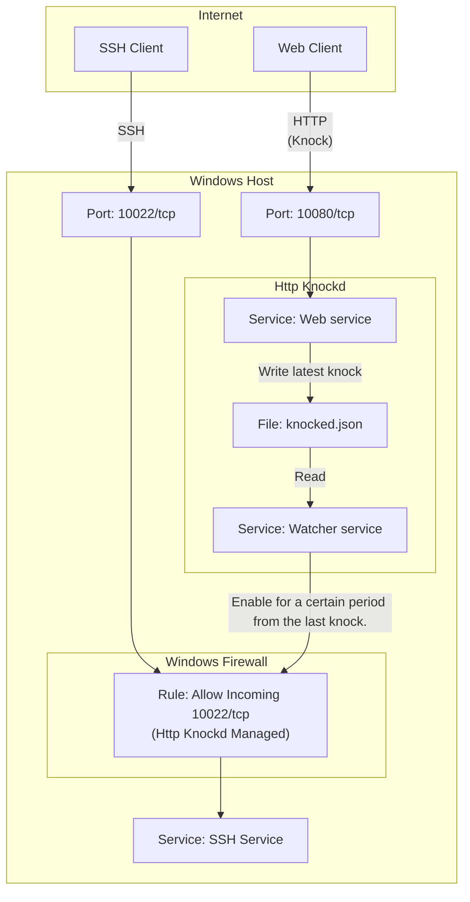

# PSHttpKnockd

HTTPアクセスがあったとき、一定時間、指定ポートをオープンします。

## はじめに

指定の HTTP サービスに一定の条件のポート・ノッキングがあったときのみ、
SSH などのサービスをインターネットに公開するようにします。

## 要件

- Microsoft Windows 11+
- Windows PowerShell 5.1+
- [NSSM - the Non-Sucking Service Manager](https://nssm.cc/)

## 仕組み

1. Web サービスを起動し、一定の条件を満たす HTTP リクエストを Knock と判断します。
1. Knock があった場合、一定期間、ファイアウォールのルールを有効にします。



## 使い方

### インストールする

あらかじめ NSSM をインストールしてください。

PowerShell を管理者権限で実行して、設定を編集し、インストール用のコマンドを実行してください。

```powershell
git clone https://github.com/kumarstack55/PSHttpKnockd.git

Set-Location .\PSHttpKnockd

Copy-Item .\configurations.json.sample .\configurations.json
notepad.exe configurations.json

.\Install-HttpKnockd
```

### サービスを起動する

`services.msc` を実行し、サービス一覧からサービス名を選択し、開始してください。

## 設定

設定は `configurations.json` で行います。

- `WebServiceName`
    - Web サービスの名前です。
- `WatchServiceName`
    - Watcher サービスの名前です。
- `MutexNameToRewriteKnockedJson`
    - knocked.json を読み書きするための Mutex 名です。
- `EventLogLogName`
    - イベント・ログに記録する際の LogName です。
- `EventLogSource`
    - イベント・ログに子rくする際の Source です。
- `FirewallRuleName`
    - Http Knockd が管理する Windows ファイアウォールのルールの名前です。
- `FirewallRuleTcpPortNumber`
    - Http Knockd が管理する Windows ファイアウォールのポート番号です。
- `KnockServicePortNumber`
    - Http Knockd の Web サービスが待ち受けるポート番号です。
- `WatchTimeInterval`
    - Watcher サービスがファイルを確認する間隔です。秒単位です。
- `TimeToDisableRule`
    - ノックがあった時刻から、ルールを許可する時間です。秒単位です。

## QA

### アンインストールする

PowerShell を管理者権限で実行する。

```powershell
Set-Location .\PSHttpKnockd

.\Uninstall-HttpKnockd
```

## TODO

- [ ] Web サービスを管理者権限なしに起動できるようにする。

## ライセンス

MIT